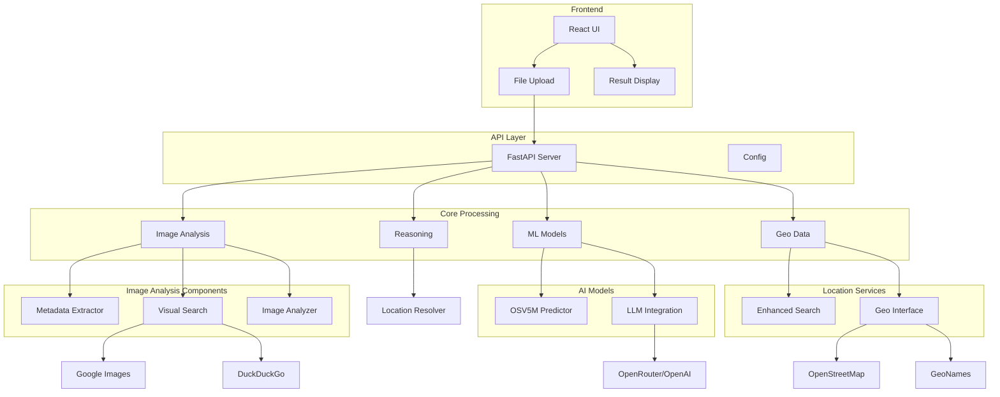

# Open Geo Spy - Architecture Overview

This project is a sophisticated geolocation system that analyzes images and videos to predict their geographical location using multiple data sources and AI models.

## Core Features

1. **Image Analysis**
   - Extracts text, business names, landmarks, and architectural features
   - Analyzes environmental features (terrain, vegetation, buildings)
   - Processes metadata including EXIF data
   - Supports both images and videos

2. **Location Detection**
   - Multi-source location search (Google, OSM, GeoNames)
   - Business and landmark verification
   - License plate recognition and region mapping
   - Visual similarity search

3. **AI/ML Integration**
   - Uses OpenAI/OpenRouter for text analysis
   - Implements OSV5M model for location prediction
   - Visual search capabilities
   - Advanced reasoning system for location resolution

4. **Web Interface**
   - React-based frontend
   - File upload support
   - Interactive map display
   - Result visualization

## System Architecture

## Data Flow

1. User uploads image/video through the frontend
2. API receives file and initiates analysis
3. Image Analysis extracts features:
   - Text and entities
   - Environmental features
   - Metadata
4. Multiple location searches are performed:
   - OSV5M prediction
   - Visual similarity search
   - Geographic database queries
5. Location Resolver combines all data points
6. Final location prediction is returned to frontend

## Key Components

- **ImageAnalyzer**: Core component for feature extraction
- **GeoLocator**: Main orchestrator for the location detection process
- **LocationResolver**: Combines multiple data sources for final prediction
- **VisualSearchEngine**: Finds visually similar locations
- **EnhancedLocationSearch**: Advanced location search using multiple sources

## Technologies Used

- **Frontend**: React, TypeScript, Leaflet
- **Backend**: Python, FastAPI
- **AI/ML**: OpenAI/OpenRouter API, OSV5M
- **Databases**: OpenStreetMap, GeoNames
- **External APIs**: Google Places, DuckDuckGo

## Performance Considerations

- Parallel processing for multiple search sources
- Caching for API responses
- Efficient image processing with chunking
- Smart candidate filtering and ranking

## Security Features

- API key management
- Rate limiting
- Input validation
- Secure file handling 